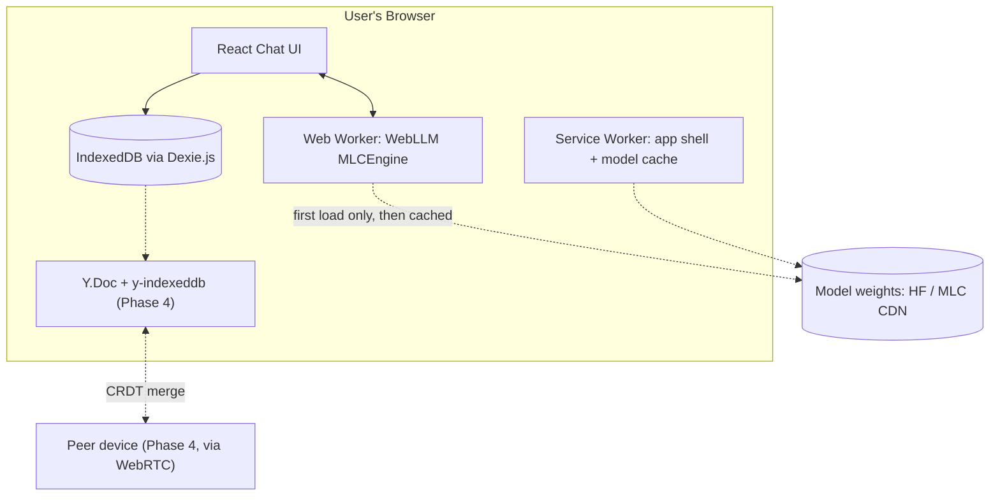

# EdgeChat — Local-First AI Chatbot

> Working name — rename freely, referenced as "EdgeChat" throughout this doc.

## 1. Vision

A chatbot where the model runs on the user's own device instead of a server. Open the tab, download the model once, and every reply after that comes from local inference — no API key, no per-token cost, no round-trip to a server, and nothing typed has to leave the browser unless sync is explicitly turned on.

## 2. Goals

- Real, streaming AI replies from a quantized LLM running entirely in-browser via WebGPU
- Chat history persists locally and survives refreshes and restarts
- Installable as a PWA; fully usable offline once the model is cached
- (Stretch) Multiple devices/tabs converge on one chat history via CRDT sync, with no central server owning the data

## 3. Non-Goals (v1)

- No training or fine-tuning of any model — this is inference only
- No accounts, login, or multi-tenant chat rooms
- No server-hosted copy of chat history by default — that would defeat the point of "local-first"
- No guaranteed support for browsers without WebGPU (Safari and Firefox are still catching up) — degrade with a clear message instead of pretending to support them

## 4. Key Decisions

| Decision | Choice | Why |
|---|---|---|
| Inference engine | WebLLM (`@mlc-ai/web-llm`) | Purpose-built for full conversational LLM inference in-browser, OpenAI-compatible API, ~80% of native speed via WebGPU — more mature for this specific job than Transformers.js or LiteRT.js right now |
| Default model | Smallest instruct model in WebLLM's list (~2–3B) | Keeps the "sweet spot" on phones and base laptops; bigger models are opt-in |
| CRDT sync | Pushed to Phase 4, optional | Ship one complete, working local chatbot first; add multi-device sync once the core product actually works, not before |
| Sync transport | `y-webrtc` (peer-to-peer) | Keeps the whole app backend-less — consistent with "local-first," unlike a hosted relay |
| Conversation model | Single thread for v1 | Multi-thread history is a nice-to-have (Phase 5), not core |

## 5. Architecture

## 6. Tech Stack

| Layer | Choice |
|---|---|
| Framework | React + Vite + TypeScript |
| Styling | Tailwind CSS (matches Stitch's exported markup if you design there first) |
| Local inference | `@mlc-ai/web-llm`, run inside a Web Worker — never the main thread |
| Local storage | Dexie.js over IndexedDB |
| Offline/installable | `vite-plugin-pwa` (manifest + service worker) |
| Sync (Phase 4) | Yjs + `y-indexeddb` + `y-webrtc` |
| State management | React hooks/Context — only reach for Zustand if it gets unwieldy |

## 7. Implementation Phases

Each phase is meant to be its own Antigravity session — see the companion terminal prompt for how to run one at a time.

### Phase 0 — Scaffolding
- `npm create vite@latest` (react-ts template), add Tailwind, ESLint, Prettier
- Folder structure: `src/components`, `src/workers`, `src/lib`, `src/store`
- **Done when:** `npm run dev` shows a styled blank shell; lint and build both pass.

### Phase 1 — Local Chat Shell
- Message list, composer, send button, timestamps, empty state
- Dexie schema: `messages { id, role, content, createdAt, conversationId }`
- Every message persists to IndexedDB; history survives a refresh
- If a Stitch export (DESIGN.md or HTML/Tailwind components) exists in the repo, build from that instead of styling from scratch
- **Done when:** refreshing the page keeps the conversation intact.

### Phase 2 — Edge AI Brain
- Add WebLLM; initialize `MLCEngine` inside a dedicated Web Worker
- WebGPU capability check on load; unsupported devices get a clear inline message, not a silent failure
- Progress bar for the first model download
- Stream tokens into the UI as they generate — don't wait for the full response
- Default to the smallest instruct model in WebLLM's current list (check `prebuiltAppConfig.model_list` — something in the Llama 3.2 / Phi-3.5 / Qwen2.5 small-instruct family); add a model dropdown in Settings for bigger models on capable devices
- **Done when:** messages get a real streamed local reply with zero network calls after the first cache.

### Phase 3 — Offline / PWA
- Web manifest and icons
- Service worker caches the app shell (`vite-plugin-pwa`); confirm the cached model and IndexedDB history both survive a reload with Wi-Fi off
- Online/offline indicator; "Install app" prompt
- **Done when:** after one online visit, airplane mode + reopen still lets you chat.

### Phase 4 — CRDT Sync (optional / stretch)
- Model each conversation as a `Y.Doc` holding a `Y.Array` of messages
- `y-indexeddb` for local CRDT persistence
- `y-webrtc` for peer-to-peer sync between tabs/devices — no backend required
- Manual test: two tabs open, disconnect one, send messages in both, reconnect, confirm both threads merge with nothing lost
- **Done when:** the two-tab test passes repeatedly, in either order.

#### Pairing & Identity

EdgeChat has **no account system**. Two devices merge their chat history only because they were deliberately paired by their owner — never because of anything a server tracks.

- **Room ID generation** — On first launch each device generates a random room ID via `crypto.randomUUID()` and stores it in `localStorage`. This ID becomes the `y-webrtc` room name used by `SyncProvider`. Until two devices share the same room ID they are invisible to each other.

- **Pairing flow** — Getting two devices onto the same room ID is an out-of-band operation:
  1. *QR code (primary)* — The first device displays a QR code encoding its room ID. The second device scans the code and adopts that room ID, replacing its own.
  2. *Manual pairing code (fallback)* — The room ID is also displayed as a short human-readable string that can be typed into the second device when a camera is unavailable.

- **Encryption / password** — The default Yjs signaling servers (`wss://signaling.yjs.dev`) are public. Without a password, anyone who guesses or intercepts a room name could join and read/write messages. To prevent this the shared room ID is also passed as the `password` option in the `WebrtcProvider` config, which causes `y-webrtc` to encrypt all traffic before relaying it through the signaling server.

- **Privacy guarantee** — No user accounts, no tokens, no server-side state. The signaling server only relays encrypted, opaque blobs and cannot read message content. Devices merge *only* because they were deliberately paired (same room ID + password), never via server-side tracking.

### Phase 5 — Polish
- Settings: model picker, clear-history, storage usage indicator
- Error boundaries and graceful degradation states
- Keyboard navigation + aria-label pass
- Tests specifically on the Dexie/Yjs data layer — that's the part that fails silently if it's wrong

## 8. Non-Functional Requirements

- First model download is several hundred MB — always show progress, never block the UI thread
- Primary supported browsers: Chrome/Edge 113+ desktop, Chrome Android 121+; Safari/Firefox are best-effort, not blocking
- Call `navigator.storage.persist()` so the browser doesn't evict the cached model under storage pressure

## 9. Risks

| Risk | Mitigation |
|---|---|
| WebGPU unsupported on the user's device | Capability check + clear message (Phase 2), not a silent crash |
| Large model download over mobile data | Default to the smallest model; warn before downloading on a metered connection |
| Browser evicts the cached model | `storage.persist()` request in Phase 3 |
| CRDT merge bug corrupts history | Keep Phase 4 behind a flag until the two-tab test is reliably clean |

## 10. Open Questions (yours to decide, not the agent's)

- Final name/branding
- Whether voice input/output is ever in scope
- Where this gets deployed (Vercel, Netlify, GitHub Pages — any static host works since there's no backend by default)
